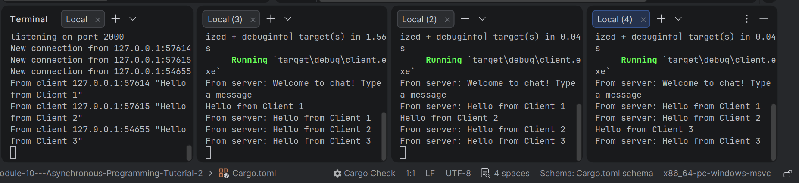

Module 10 - Tutorial 2: Broadcast Chat

Experiment 2.1: Original code, and how it run

In this experiment, I implemented the original broadcast chat application. The project has two binaries, which are server.rs and client.rs. The server is run using cargo run --bin server, while each client is run using cargo run --bin client. I ran one server and three clients as requested in the tutorial. When a client sends a message, the message is received by the server through the websocket connection. The server then broadcasts the message to all connected clients. This shows that asynchronous programming is useful for a chat application because the server can handle messages from multiple clients without blocking the whole program.