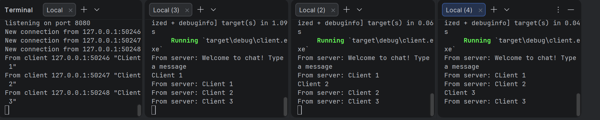
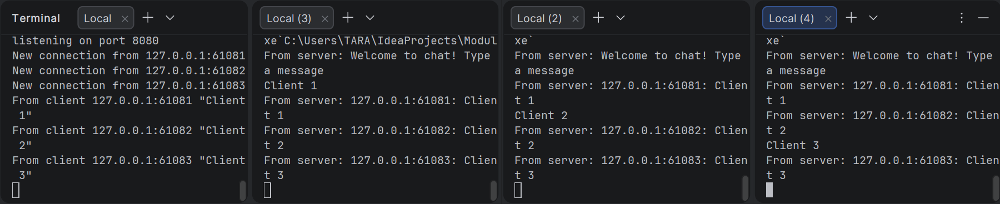

Module 10 - Tutorial 2: Broadcast Chat

Experiment 2.1: Original code, and how it run

In this experiment, I implemented the original broadcast chat application. The project has two binaries, which are server.rs and client.rs. The server is run using cargo run --bin server, while each client is run using cargo run --bin client. I ran one server and three clients as requested in the tutorial. When a client sends a message, the message is received by the server through the websocket connection. The server then broadcasts the message to all connected clients. This shows that asynchronous programming is useful for a chat application because the server can handle messages from multiple clients without blocking the whole program.

Experiment 2.2: Modifying port

In this experiment, I modified the websocket port from 2000 to 8080. The port needs to be changed in both server.rs and client.rs because the websocket connection has two sides: the server side and the client side. In server.rs, the port is defined in TcpListener::bind("127.0.0.1:8080"), so the server listens for incoming connections on port 8080. In client.rs, the port is defined in Uri::from_static("ws://127.0.0.1:8080"), so the client connects to the websocket server using the same port. The websocket protocol is ws, and it is written in the client URI. After changing both files, the application still runs properly because the server and all clients use the same websocket address and port.

Experiment 2.3: Small changes, add IP and Port

In this experiment, I modified the server so that the message broadcasted to clients also includes the sender's IP address and port. The change was made in server.rs, specifically in the part where the server receives a message from a websocket client. Before this modification, the server only sent the message text to all clients. After the modification, the server sends format!("{addr}: {text}"), so each client can see where the message came from. The addr value contains the socket address of the sender, including the IP address and port. This helps show how the message is passed from the client to the server, then broadcasted again to all connected clients.